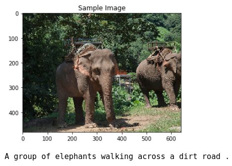
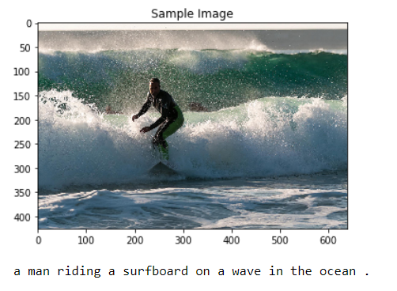
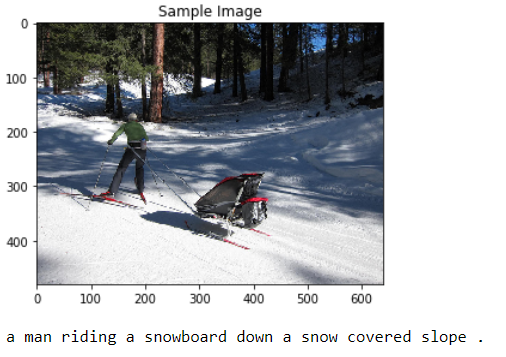
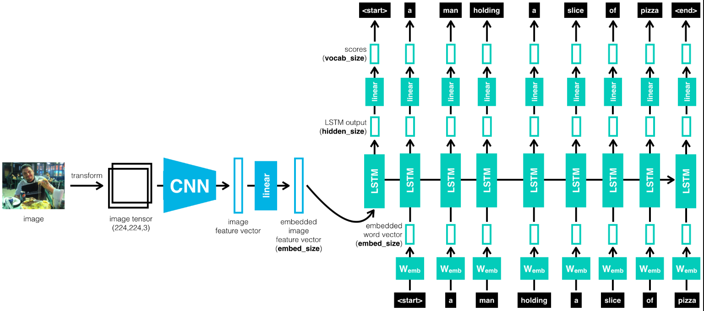
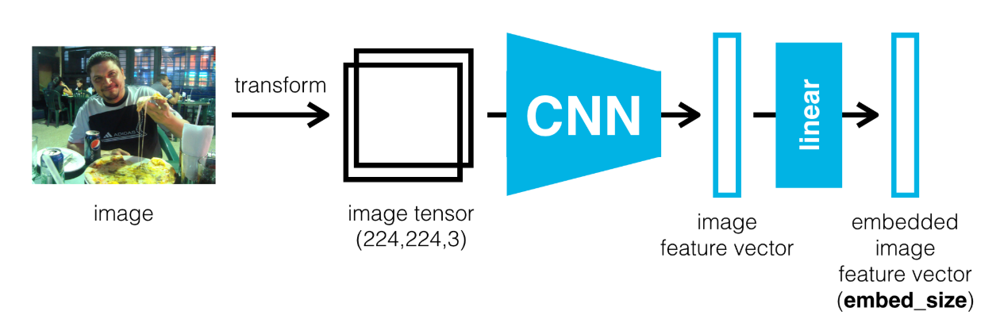
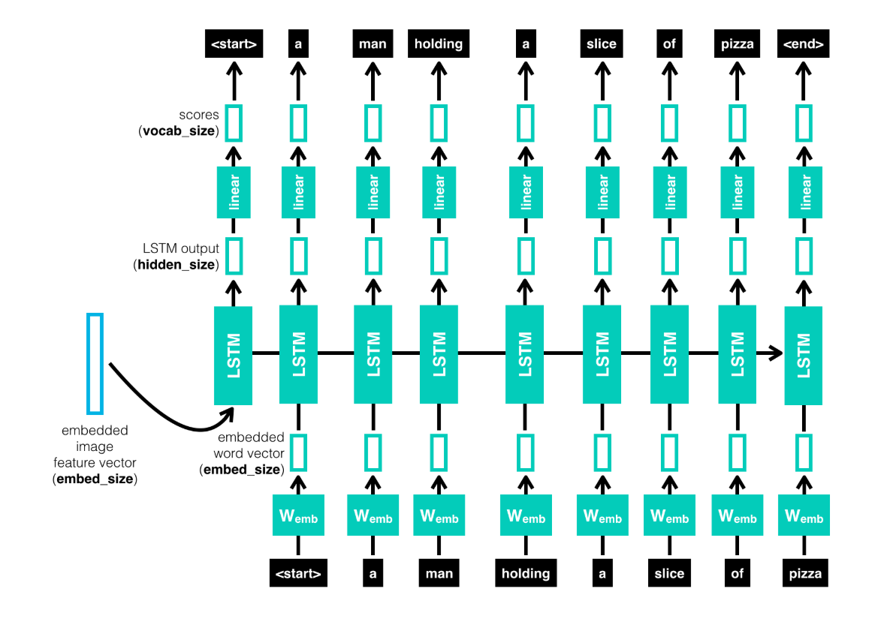

# Automatic Image Captioning with Pytorch

## Project Overview
Image Captioning is the process of automatically captioning a unseen image. It uses both Natural Language Processing and Computer Vision to generate the captions. Below are some examples of images on whoch automatic image captioning has been used to generate captions.


<br>

<br>

<br>

---

## Network Topology



**Encoder:** <br>
For the Encoder, I used a Convolutional Neural Network(CNN). The image is given to CNN to extract the relevant features. The last hidden state in CNN is connected to Decoder The encoder uses a pre-trained ResNet-50 architecture (with the final fully-connected layer removed) to extract features from a batch of pre-processed images. The output is then flattened to a vector, before being passed through a Linear layer to transform the feature vector to have the same size as the word embedding



**Decoder:** <br>
 For the Decoder, I used a Recurrent Neural Network (RNN) which takes the features from encoder and produces a sentence for it



---

## Dataset
The Microsoft **C**ommon **O**bjects in **CO**ntext (MS COCO) dataset is a large-scale dataset for scene understanding.  The dataset is commonly used to train and benchmark object detection, segmentation, and captioning algorithms.  


---

### Local Environment Instructions

1. Clone the repository, and navigate to the downloaded folder. This may take a minute or two to clone due to the included image data.
	```
	git clone https://github.com/rohitvk1/Automatic-Image-Captioning-with-Pytorch.git
	```
2. Create (and activate) a new Anaconda environment (Python 3.6).
Download via [Anaconda](https://www.anaconda.com/distribution/)

	- __Linux__ or __Mac__: 
	```
	conda create -n cv-nd python=3.6
	source activate cv-nd
	```
	- __Windows__: 
	```
	conda create --name cv-nd python=3.6
	activate cv-nd
	```

3. Install PyTorch and torchvision; this should install the latest version of PyTorch;
```
conda install pytorch torchvision cudatoolkit=9.0 -c pytorch
```
6. Install a few required pip packages, which are specified in the requirements text file (including OpenCV).
```
pip install -r requirements.txt
```
